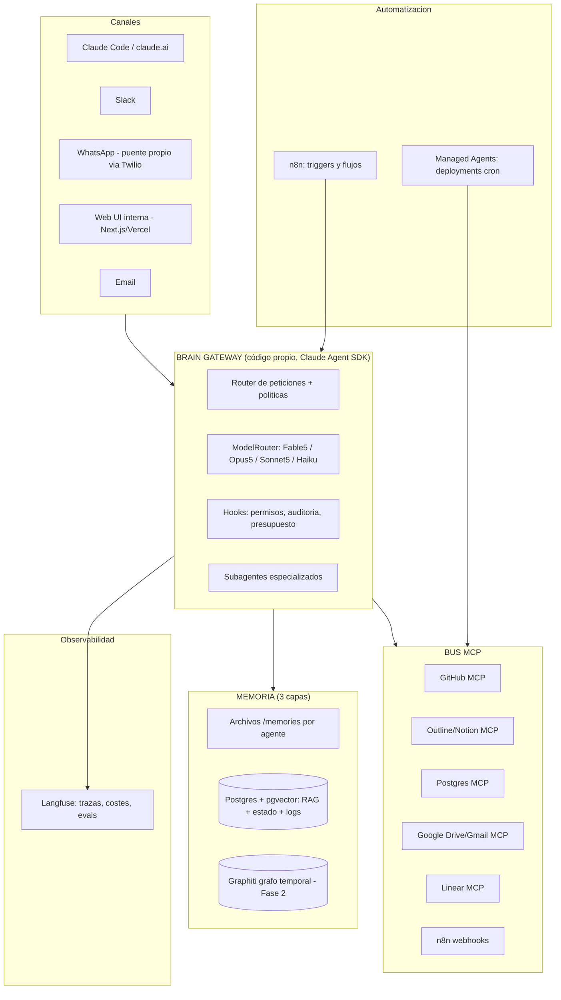

# Fase 4 — Arquitectura propuesta de JorZunex Brain

## 1. Principios de diseño

1. **El modelo es reemplazable; los datos y las integraciones no se negocian.** Todo dato vive en Postgres/Markdown/repos propios; toda integración habla MCP. Cambiar de modelo (o de proveedor) toca solo el gateway.
2. **80–90% integración, 10–20% código.** El código propio es pegamento, canal y política; nunca infraestructura genérica.
3. **Cada componente detrás de una interfaz.** `Retriever`, `ModelRouter`, `Channel`, `MemoryStore` son interfaces del gateway; las implementaciones (pgvector, Claude, Slack, archivos) se cambian sin tocar el resto.
4. **Docs-as-code:** todo conocimiento técnico en Markdown versionado = indexado gratis por el Brain.
5. **Aplazar complejidad:** nada entra al stack sin dolor medido que lo justifique.

## 2. Diagrama lógico



## 3. Componentes, justificación y riesgos

### 3.1 Brain Gateway (código propio — la única pieza central custom)
Servicio (TypeScript o Python, en el VPS) construido sobre **Claude Agent SDK**:
- Recibe peticiones de cualquier canal, resuelve identidad y contexto.
- **ModelRouter:** política declarativa de selección de modelo (tipo de tarea → modelo + effort + presupuesto). Aquí se controla el gasto.
- **Hooks** PreToolUse/PostToolUse: lista blanca de herramientas por canal/usuario, auditoría a Langfuse, confirmación humana para acciones irreversibles.
- Persiste cada conversación en Postgres (la sesión SDK es efímera; el log es la fuente de verdad — patrón de producción estándar).
- Maneja `stop_reason: "refusal"` de Fable 5 con fallback server-side a Opus.

*Alternativas evaluadas:* LangGraph (más portable, mucho más código), Managed Agents puro (menos control, beta). *Mantenimiento esperado:* bajo (el SDK absorbe el bucle). *Lock-in:* medio — mitigado porque la lógica vive en prompts/MCP/Postgres, no en APIs propietarias del SDK.

### 3.2 Bus MCP
Cada sistema externo se conecta una vez como servidor MCP y queda disponible para: el gateway, Claude Code de cada dev, claude.ai del equipo y los Managed Agents. Configuración versionada en el repo (`.mcp.json`).
*Riesgo:* servidores comunitarios de calidad variable → preferir oficiales; fijar versiones; revisar permisos (un MCP con write es una superficie de ataque — ver riesgos, prompt injection).

### 3.3 Memoria en 3 capas
| Capa | Tecnología | Contenido | TTL |
|---|---|---|---|
| Trabajo | Memory tool (archivos por agente, en repo/volumen) | Lecciones, preferencias, estado de tareas | Permanente, curado |
| Conocimiento | Postgres+pgvector; ingesta desde Outline/Drive/repos vía n8n | Documentos, decisiones, contratos | Reindexado incremental |
| Organizacional (F2) | Graphiti sobre FalkorDB | Entidades y relaciones con validez temporal (clientes, proyectos, responsables) | Evolutivo |

La interfaz `Retriever` del gateway unifica las tres: el agente pide "contexto sobre X" y el gateway decide dónde buscar.

### 3.4 Wiki (Outline, pendiente de confirmar vs Notion)
Fuente de verdad del conocimiento humano-legible. El Brain la lee Y la escribe vía MCP (p. ej. "documenta la decisión de hoy"). Export Markdown continuo → backup + corpus RAG.

### 3.5 Automatización (n8n + Managed Agents cron)
- n8n: triggers externos (email entrante, webhook de GitHub, formulario) → llama al gateway o ejecuta flujos simples sin LLM (más barato).
- Managed Agents deployments: trabajos programados con agente completo (informe semanal, revisión de backlog nocturna).

### 3.6 Observabilidad (Langfuse)
Toda llamada del gateway se traza: modelo, coste, latencia, herramientas usadas, feedback. Es el instrumento para (a) recortar coste, (b) detectar regresiones de prompts, (c) auditoría.

### 3.7 Canales
- **Slack**: primera integración de equipo (MCP/bot).
- **Web UI interna** (Next.js en Vercel + Clerk): consola del Brain — chat, búsqueda en memoria, estado de agentes.
- **WhatsApp**: puente propio (webhook Twilio → gateway). Único desarrollo de canal significativo; aislado tras la interfaz `Channel`.

## 4. Estrategia anti-lock-in (resumen por proveedor)

| Dependencia | Nivel | Mitigación |
|---|---|---|
| Anthropic (modelos) | Alto | ModelRouter abstraído; prompts en repo; MCP es multi-vendor; el log de conversaciones es nuestro (Postgres) |
| Claude Agent SDK | Medio | Lógica de negocio fuera del SDK (prompts, MCP, Postgres); LangGraph documentado como plan B |
| Managed Agents (beta) | Medio | Solo cron/batch; cualquier deployment se puede rehacer como n8n cron + gateway |
| Outline / Notion | Bajo | Export Markdown continuo |
| n8n | Bajo | Flujos exportables JSON; solo pegamento |
| Supabase/Neon | Bajo | Es Postgres estándar; `pg_dump` |
| Langfuse | Bajo | OpenTelemetry estándar |
| Clerk | Medio | Aislar en el frontal; usuarios exportables |

## 5. Topología física (Fase 1)

```
VPS Hetzner (CX32/CX42, ~€20-40/mes) + Coolify
├── brain-gateway        (Agent SDK, Node/Python)
├── outline + postgres   (wiki)
├── n8n
├── langfuse (postgres + clickhouse)
└── postgres principal   (o Supabase managed — decisión pendiente)

Vercel  → web UI interna (Next.js + Clerk)
Anthropic → API Claude + Managed Agents (cron)
Cloudflare → DNS/proxy
GitHub → repos, Actions, MCP
```
